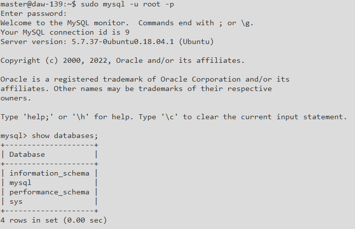
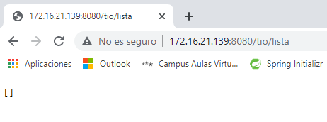

## Tarea FTP - Despliegue de aplicación en VPS

*:pushpin: Celia Corrales, Eresma Ibáñez y Jennifer Díez - Despliegue de Aplicaciones Web - Curso 2021/2022*

​	A continuación se detallan los pasos más relevantes en el despliegue de nuestra aplicación web. Ésta se ha desplegado en la nube privada del aula, concretamente en el servidor `172.16.21.140`.

​	Las instalaciones y configuraciones iniciales las realizaremos mediante PuTTY, un cliente SSH que nos permite conectarnos al servidor desde nuestro equipo. En primer lugar instalamos **MySQL** para trabajar con la base de datos de nuestra aplicación, la cual se llama `test_virtual`.

​	El siguiente paso es instalar **Java** y la herramienta de software **Maven**.

​	Instalamos además el servidor **vsFTPd**, uno de los servidores FTP más potentes y completos para Linux.

​	En este punto del proceso, pasamos a utilizar FileZilla, uno de los clientes FTP más populares que nos permite conectarnos al servidor al igual que lo hace PuTTY, pero en este caso mediante un entorno gráfico donde podemos ver los directorios, archivos, etc. Mediante FileZilla creamos la estructura de carpetas separando la parte del backend con la del frontend de nuestra aplicación.

​	Si probamos a lanzar nuestra aplicación (sin el apartado del frontend configurado todavía), comprobamos que **Spring** funciona sin problemas y que en el navegador podemos acceder al servidor.

El siguiente paso es instalar el servidor **Apache** para el despliegue de nuestra aplicación. Lo configuramos para que soporte SSL, habilitamos el modo ssl, reiniciamos. Creamos una copia de seguridad de los archivos y editamos los archivos *000-default.conf* y *apache2.conf*, los habilitamos y reiniciamos.

Tenemos que configurar spring para que sea un modo seguro creando un certificado.

Se comprueba que se ha creado en la ruta correcta. Editamos el archivo properties para añadir la configuración SSL. Y Instalamos maven, comprobamos que funcione.

Subimos los archivos con el filezilla a la ruta */var/www/html*.

Comprobamos que funciona

Añadimos un usuario

